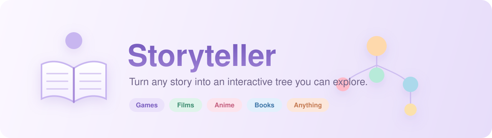
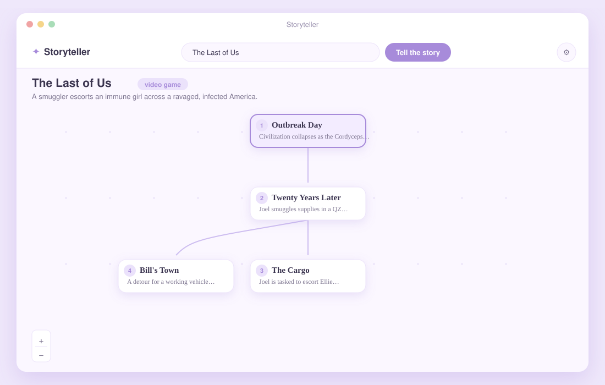
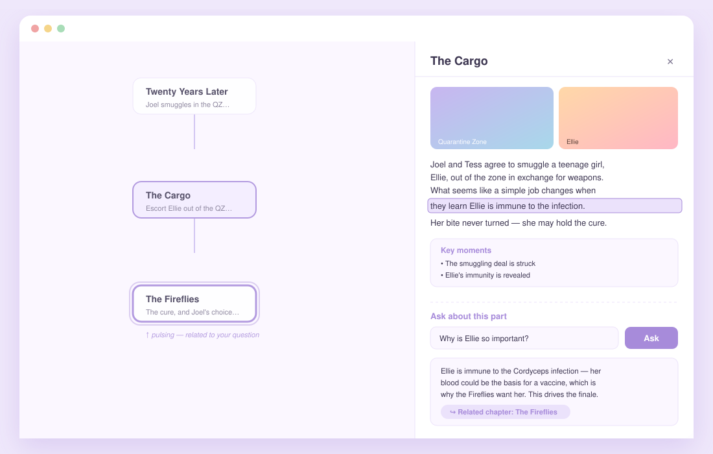
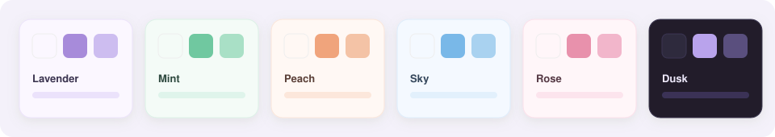
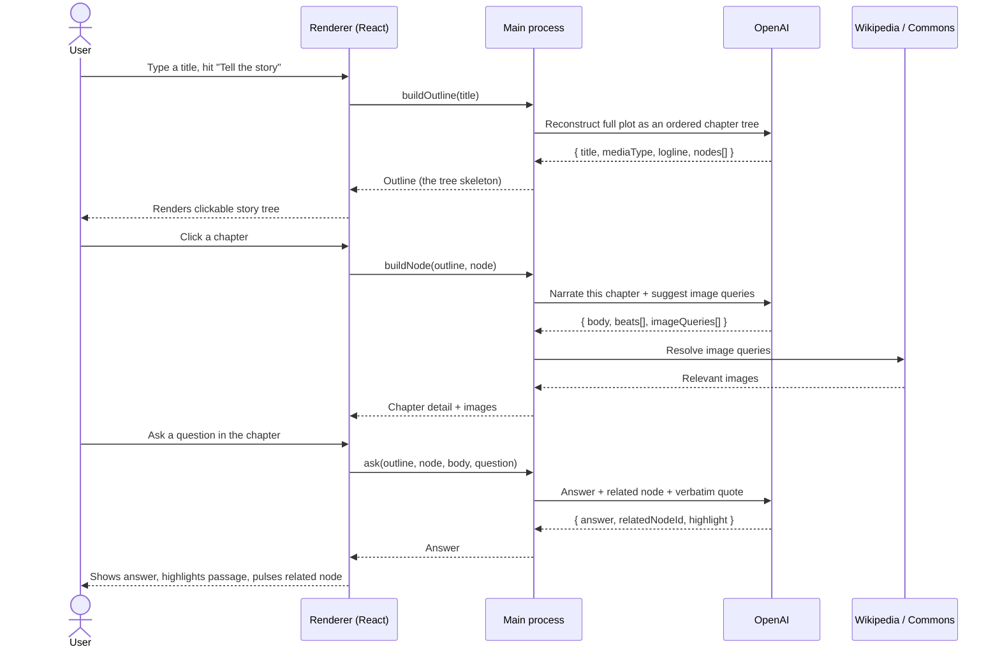
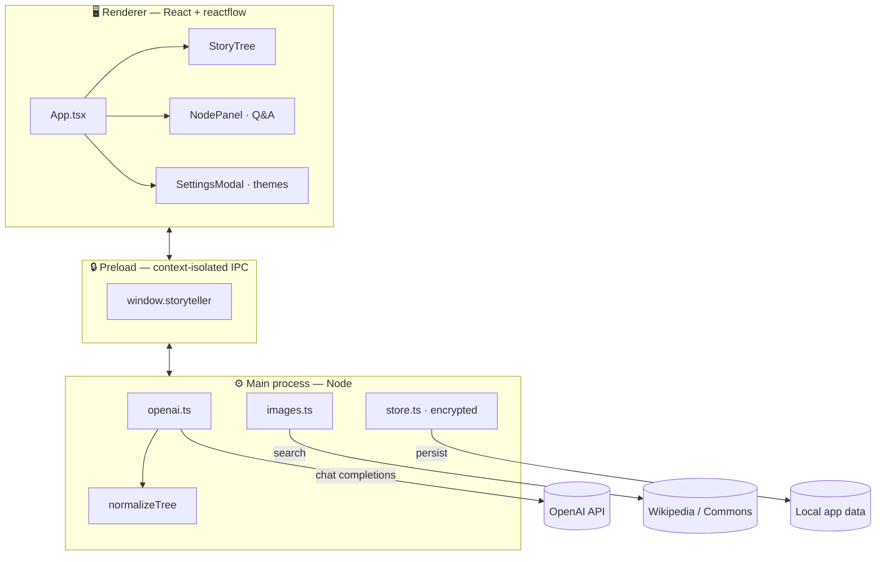

<div align="center">



<br/>

**Type the name of _any_ work — a game, film, anime, series, book or comic — and Storyteller reconstructs its entire story as an interactive, clickable tree of chapters you can explore at your own pace.**

<br/>

[](#-installation)
[](https://www.electronjs.org/)
[](https://react.dev/)
[](https://www.typescriptlang.org/)
[](https://platform.openai.com/)
[](#-license)

<br/>

[**Features**](#-features) · [**Demo**](#-demo) · [**How it works**](#-how-it-works) · [**Install**](#-installation) · [**Architecture**](#-architecture) · [**Roadmap**](#-roadmap)

<br/>



</div>

---

## ✨ Overview

Most summaries dump an entire plot into one wall of text. **Storyteller** instead turns a story into a **map you can walk through**:

1. You search a title.
2. An AI lays out the whole tale — start to finish, including the ending — as a **chronological tree of chapters**.
3. You click any node to read that part in full, with relevant imagery.
4. Stuck on something? **Ask a question right inside the chapter** — the answer can highlight the exact passage and pulse the related chapter on the map.

It's built as a polished, minimalist **desktop app** with pastel theming, and runs on **your own OpenAI API key** — your key, your data, stored locally.

---

## 🌟 Features

| | Feature | Description |
|---|---|---|
| 🌳 | **Story-as-a-tree** | Any media's full plot, reconstructed as an ordered, clickable chapter graph — branches only where the story genuinely splits. |
| 🧩 | **Lazy, part-by-part loading** | The outline loads first (fast); each chapter's full narrative is fetched **on demand** when you open it. |
| 💬 | **Ask inside any chapter** | A built-in Q&A box answers questions about that part — and links you to whichever chapter is most relevant. |
| 🔦 | **Answer highlighting** | When the answer is already in the text, that exact passage is **highlighted**, and the related node **pulses** on the tree. |
| 🖼️ | **Automatic imagery** | Each chapter pulls relevant images from Wikipedia / Wikimedia Commons — no extra API key needed. |
| 🎨 | **Six pastel themes** | Lavender, Mint, Peach, Sky, Rose and a dark **Dusk** — switchable live in Settings. |
| 🌐 | **Multilingual** | Tell the story in your language, or let it match whatever you typed. |
| 🔐 | **Local-first & private** | Your OpenAI key is stored encrypted on your device and used to talk to OpenAI directly. Never bundled, never committed. |
| 🧠 | **Model picker** | Choose any chat model your key can access (`gpt-4o`, `gpt-4.1`, `o4-mini`, …). |
| 📦 | **Real installer** | Ships as a Windows `.exe` (NSIS) with a hand-crafted app icon. |

---

## 🎬 Demo

> The screens below are rendered mockups of the actual UI.

<div align="center">

### Explore the whole story at a glance


<br/><br/>

### Read a chapter, ask a question, follow the thread


<br/><br/>

### Make it yours — six pastel themes


</div>

---

## 🔭 How it works

Storyteller splits the work into two cheap, focused AI calls, plus a free image lookup:



**Why a tree (and not a flat list)?** Stories rarely move in a perfectly straight line — they have arcs, detours and parallel threads. The outline prompt enforces a clean chronological spine (chapter 1 → 2 → 3 → finale) and only branches when the story really splits, with a normalization pass that repairs any malformed graph the model returns.

---

## 🚀 Installation

### Option A — Run the installer

1. Download **`Storyteller Setup x.y.z.exe`** from the [Releases](../../releases) page.
2. Run it (Windows SmartScreen may warn because the build is unsigned → **More info → Run anyway**).
3. Launch Storyteller and paste your [OpenAI API key](https://platform.openai.com/api-keys) when prompted.

### Option B — Build from source

> **Prerequisites:** [Node.js 18+](https://nodejs.org/) and npm.

```bash
# 1. Clone
git clone https://github.com/Ernani1234/storyteller.git
cd storyteller

# 2. Install dependencies
npm install

# 3. Run in development (hot reload)
npm run dev

# 4. Build a Windows installer (.exe)
npm run dist
```

The packaged installer lands in `release/`. The app icon is generated from
[`build/icon.svg`](build/icon.svg) into `build/icon.ico` automatically.

| Script | What it does |
|---|---|
| `npm run dev` | Launch the app with hot-reloading. |
| `npm run build` | Type-check + bundle main / preload / renderer. |
| `npm run icon` | Rasterize `build/icon.svg` → `icon.ico` + `icon.png`. |
| `npm run dist` | Full production build → Windows NSIS installer. |
| `npm run dist:dir` | Build an unpacked app folder (no installer). |

---

## ⚙️ Configuration

Everything lives in **Settings** (the ⚙ icon, top-right):

- **API key** — paste and **Verify** it; stored encrypted in your local app-data folder.
- **Model** — pick any chat model your key can use.
- **Story language** — match your input, or force English / Português / Español / Français / 日本語.
- **Theme** — six pastel palettes with live preview.

---

## 🏗️ Architecture

A clean Electron split: the **main process** owns the API key and every network call; the **renderer** never sees the key and talks to main only through a typed, context-isolated bridge.



<details>
<summary><b>📁 Project structure</b></summary>

```
storyteller/
├─ build/
│  └─ icon.svg              # source app icon → rasterized to .ico/.png
├─ docs/assets/             # README artwork (banner, mockups, demo)
├─ scripts/
│  └─ generate-icon.mjs     # SVG → multi-size .ico via sharp + png-to-ico
├─ src/
│  ├─ main/                 # Electron main process
│  │  ├─ index.ts           #   window + IPC handlers
│  │  ├─ openai.ts          #   outline / chapter / Q&A + tree normalization
│  │  ├─ images.ts          #   Wikipedia + Commons image resolution
│  │  └─ store.ts           #   encrypted settings (electron-store)
│  ├─ preload/
│  │  └─ index.ts           # typed contextBridge API
│  ├─ renderer/             # React UI
│  │  ├─ src/
│  │  │  ├─ App.tsx
│  │  │  ├─ components/      #   StoryTree, NodePanel, SettingsModal, Onboarding…
│  │  │  ├─ lib/layout.ts    #   tidy top-down tree layout
│  │  │  └─ themes.ts        #   pastel palettes
│  │  └─ index.html
│  └─ shared/types.ts       # types shared across processes
├─ electron.vite.config.ts
└─ electron-builder.yml     # packaging config
```
</details>

---

## 🧱 Tech stack

| Layer | Tech |
|---|---|
| **Desktop shell** | [Electron 31](https://www.electronjs.org/) + [electron-vite](https://electron-vite.org/) |
| **UI** | [React 18](https://react.dev/), [reactflow](https://reactflow.dev/) for the node graph |
| **Language** | [TypeScript 5](https://www.typescriptlang.org/) (strict) |
| **AI** | [OpenAI SDK](https://github.com/openai/openai-node) (chat completions, JSON mode) |
| **Images** | Wikipedia + Wikimedia Commons APIs (no key required) |
| **Persistence** | [electron-store](https://github.com/sindresorhus/electron-store) (encrypted) |
| **Packaging** | [electron-builder](https://www.electron.build/) (NSIS), [sharp](https://sharp.pixelplumbing.com/) for icons |

---

## 🔐 Privacy & security

- Your OpenAI API key is **entered at runtime** and stored **only on your machine** (encrypted, in the OS app-data folder) — it is never bundled into the app and never committed to the repo.
- All AI requests go **directly from your machine to OpenAI**; there is no middle-man server.
- The renderer runs with **context isolation** and a locked-down Content-Security-Policy; it has no direct Node or network access.

---

## 🗺️ Roadmap

- [ ] Streaming chapter text (token-by-token reveal)
- [ ] Export a story tree to PDF / Markdown
- [ ] Stronger imagery (TMDB for film/TV stills, optional AI-generated art)
- [ ] Bookmarks & reading progress
- [ ] macOS and Linux builds

---

## 🤝 Contributing

Contributions are welcome! Open an issue to discuss a change, or send a PR. Please run `npm run build` (type-check + bundle) before submitting.

---

## 📄 License

[MIT](LICENSE) © Ernani Neto

<div align="center">
<br/>
<sub>Built with ✦ — turning stories into maps.</sub>
</div>
